# Data Structures for Coding Interviews in JavaScript -- Coderust

### Introduction to Arrays

#### Arrays
- `push()` function
    - Basic
        - complexity of the `push()` operation will be O(1)
            - only have to update the `length` of the array and add new element
    - 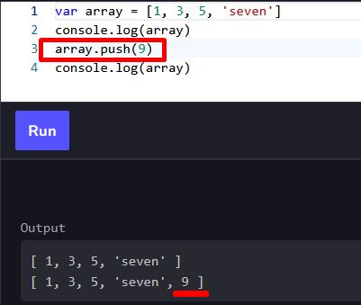
- `pop()` function
    - Basic
        - complexity of the `pop()` operation will be O(1)
            - only have to update the `length` of the array and remove one element
    - 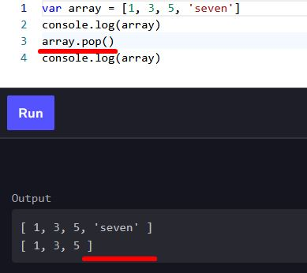
- `shift()` function
    - Basic
        - complexity of the `shift()` operation will be O(n) 
            - have to ...
                - remove the element at index 0
                - shift all the elements to the left, 
                - and update length of an array.
    - 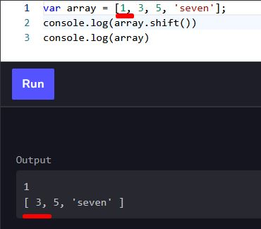
- `unshift(value)`
    - Basic
        - complexity of the `unshift()` operation will be O(n) 
            - have to 
                - update the length of an array
                - shift all the elements to the right
                - add the new element at index 0.
    - 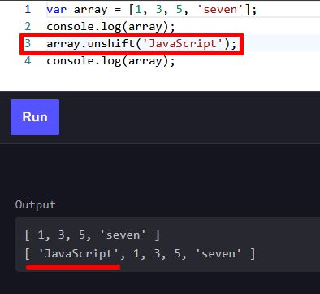
- `delete` keyword
    - Basic
        - Elements of an array can be deleted using `delete`
            - However
                - `delete` leaves undefined holes in the array
                    - aka... `undefined`
            - Better to use the shift() or pop() method.
    - Complexity
        - complexity of the `delete()` function will be O(n)
            - have to ...
                - remove the first element
                - move all the following elements to the left.
    - 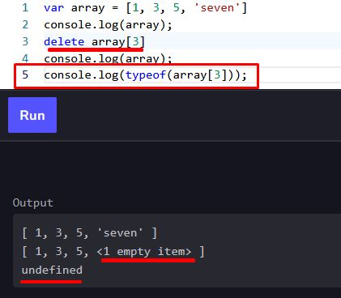
- `reverse()` function
    - Basic
        - complexity of the reverse() function will be O(n) since we have to...
            -  traverse all the elements of an array.
    - 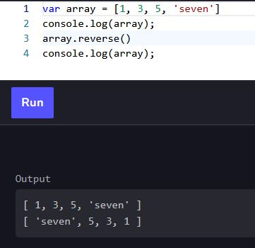
- `splice()` function
    - Basic
        - used to add or remove elements.
        - first parameter is the **index number**, where the new elements should be spliced in
            - index number
            - where the new elements should be spliced in
        - second parameter is the **number of elements** that should be removed
            - put `0` if you don’t want to remove anything
        - complexity
            - O(n)
                - worst-case, we have to shift n−1 elements.
    - 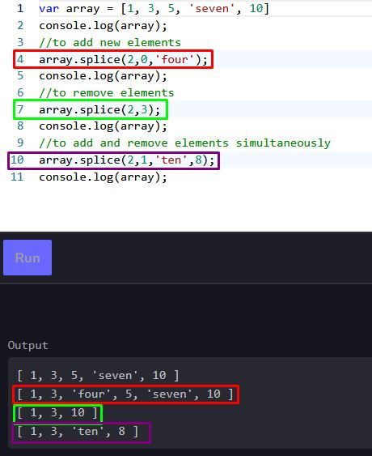
- `slice()` function
    - Basic
        - used to slice out a piece of an array into a new array.3
        - first parameter --> index number
            - start of the slicing takes place
        - second parameter --> index number
            - up to which the array should be sliced out
            - the new array excludes this index number
                - if you want the very end of the array...
                    - leave second parameter empty
    - complexity of `slice()` function is O(n)
        - to returns a new array,
            - needs to run from the start to the end
        - worst-case
            - need to make a copy of all the elements present in the array
    - 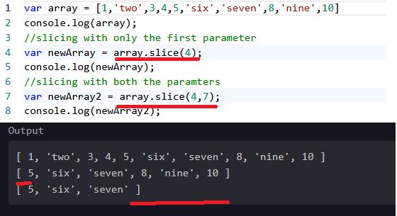
- `filter()` function
    - Basic
        - used to create a new array based on output of a function
        - filters out elements that do not pass the function
    - 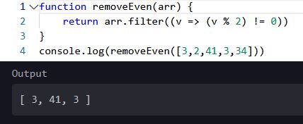
- `concat()` function
    - Basic
        - concatenate any number of arrays you want by..
            - specifying all of them as parameters to `concat()` function.
    - complexity
        -  O(m+n)
            - m is the size of the first array
            - n is the size of the second array
        - need to copy elemebts of both arrays **one by one** into a new array
    - 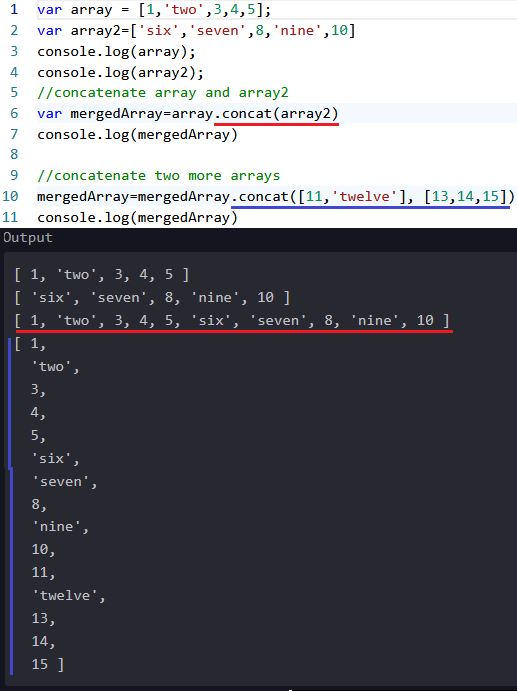
- `for...of` statement 
    - Basic
        - conditional statement for looping through an array
    - 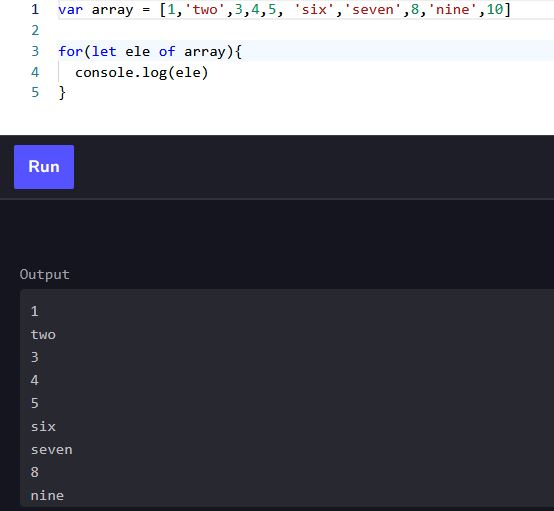

#### var vs. let vs. const
- `const` Keyword
    - `const` is block-scoped
        - variable declared with `const` cannot be redeclared 
    - 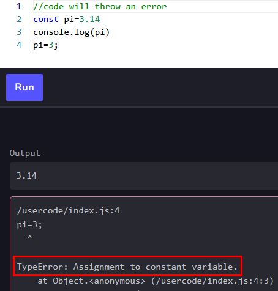
- var Keyword
    - function-scoped 
        - if declared anywhere else besides a function, 
            - will exist in the global scope.
        - 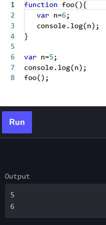
- let Keyword 
    - block-scoped.
        - cannot be redeclared within the block
        - cannot be accessed outside the block
    - 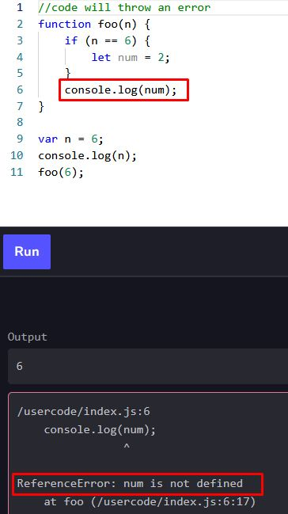
        - error because we initialized the `num` variable in the if-statement block
        - As it has been declared using `let`, 
            - we cannot access it outside the if block
    - 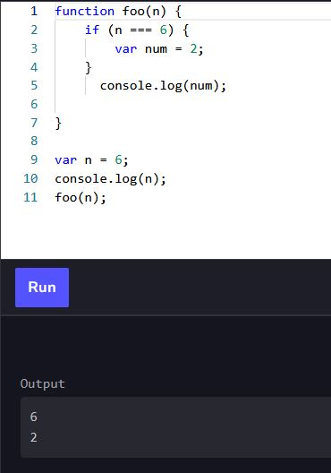
        - works fine if... 
            - we use var as they are function-scoped ... and 
            - can be accessed throughout the function.

#### Challenge 1: Remove Even Integers From an Array
- Problem
    - Problem Statement
        - Implement a function `removeEven(arr)`
            - takes an array arr in its input
            - removes all the even elements from a given array.
    - Input
        - array with random integers.
    - Output
        - array with only odd integers
    - Sample Input

        ```[1,2,4,5,10,6,3]```
    - Sample Output 
        
        ```[1,5,3]```
    - Picture
        - 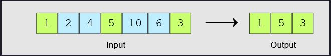
- Coding Exercise 
    - 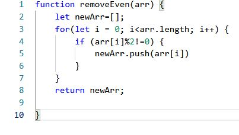

#### Challenge 2: Merge Two Sorted Arrays
- Problem
    - Problem Statement
        - Implement a function `mergeArrays(arr1, arr2)`
            - merges two sorted arrays
                - into another sorted array
    - Input
        - Two sorted arrays.
    - Output
        - consisting of all elements of both input arrays
    - Sample Input

        ```
        arr1 = [1,3,4,5]  
        arr2 = [2,6,7,8]
        ```

    - Sample Output 
        ```
        arr = [1,2,3,4,5,6,7,8]
        ```
    - Picture
        - 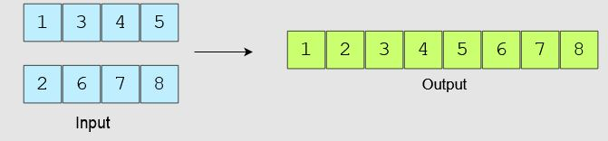
- Coding Exercise 
    ```
    function mergeArrays(arr1, arr2) {
        let mergedArr = [];
        let i=0;
        let j=0;
        if (arr1[0] == undefined) {
            return arr2
        }
        if (arr2[0] == undefined){
            return arr1
        }
        while(i < arr1.length && j < arr2.length) {
            if(arr1[i] <= arr2[j]) {
                mergedArr.push(arr1[i])
                i++
            }
            if(arr1[i] >= arr2[j]) {
                mergedArr.push(arr2[j])
                j++
            }
        }
        if (i < arr1.length) {
            arr1.splice(0, i)
            mergedArr = mergedArr.concat(arr1);
        } else if (j < arr2.length) {
            arr2.splice(0, j)
            mergedArr = mergedArr.concat(arr2)
    
        }
    
        return mergedArr;
    }
    ```
    
    ```
    function mergeArrays(arr1, arr2) {
        return mergedArr = [...arr1, ...arr2].sort((a, b)=> a - b);
    }
    ```


#### Challenge 3: Find Two Numbers that Add up to "value"
- Problem
    - Problem Statement
        - Implement a function `findSum(arr, value)`
            - input
                - takes an array `arr`, a number and `value`
            - output
                - array of two numbers that add up to value
            - If no such pair found then simply return `false`.
    - Input
        - `array` and a number `value`
    - Output
        - array with two integers `a` and `b` ([`a`,`b`]) that add up to `value`
    - Sample Input

        ```
        arr = [1,21,3,14,5,60,7,6]
        value = 81
        ```

    - Sample Output 
        ```
        arr = [21,60]
        ```
    - Picture
        - 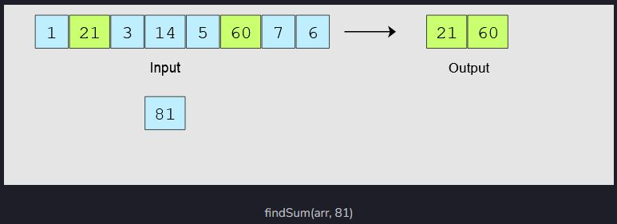
- Coding Exercise 
    ```
    function findSum(arr,value){
        let j = 1;
        for(i=0;i<(arr.length-1);i++){
            if (i==j && i<(arr.length-2)) {
                i++;
            }
            for(j=1;j<(arr.length);j++){
                if((arr[i]+arr[j])==value) {
                    return [arr[i],arr[j]]
                }
                if(i==(arr.length-2) && j==(arr.length-1)) {
                    return false
                }
            }
        }
    }
    ```


#### Solution Review: Find Two Numbers that Add up to "value"
- Sorting Array Solution
    ```  
    function binarySearch(arr, item){
       var first = 0, mid;
       var last = arr.length - 1;
       var found = false
       var arrayIndex = -1
       while( (first <= last) && !found){
           mid = Math.floor((first + last) / 2)
           if( arr[mid] == item){
               arrayIndex = mid
               found = true
           }
           else{
               if(item < arr[mid])
                   last = mid - 1
               else
                   first = mid + 1
           }
       }
       if (found)
            return arrayIndex
        else
            return false
    }
    
    function findSum(arr,value){
       arr.sort(function(a, b) {
            return a - b
        })
        var index;
        for(var j = 0; j<arr.length; j++){
            index = binarySearch(arr,(value-arr[j]))
            if(index!=false && j!=index)
                return [arr[j],value-arr[j]]
            }
        return false;
    }
    
    
    console.log(findSum([1,2,3,4],5))
    console.log(findSum([4,3,2,1],9))
    ```
    - better way to solve
        - overview
            - first sorting the array
            - use a binary search for each element in an array
    - time complexity
        - each step
            - binary search for each element takes `O(logn)`
            - binary search for all nnn elements will take `O(nlogn)`
        - overall time complexity
            - `O(nlogn)`
- Moving indices Solution
    ```
    function findSum(arr, value) {
    
        arr.sort(function(a, b) {
            return a - b
        })
    
        var index1 = 0,
            index2 = arr.length - 1,
            result = [],
            sum = 0;
    
        while (index1 != index2) {
            sum = arr[index1] + arr[index2]
    
            if (sum < value) {
                index1++;
            } else if (sum > value) {
                index2--;
            } else {
                result.push(arr[index1]);
                result.push(arr[index2]);
                return result;
    
            }
        }
      return false;
    }
    
    
    console.log(findSum([1,2,3,4],5))
    console.log(findSum([1,2,3,4],10))
    ```
    - overview
        - first sorting the array
        - use two variables
            - one starting from the first index of the array 
            - second from size-1 index of the array
        - if sum of elements is smaller than `value` ... then...
            - increment index from the start 
        - if greater than `value`... then ... 
            - decrement index from the end
                - until the given value is not equal to the sum. 
        - Store elements on these indexes in result array and return it.
    - time complexity
        - worst-case scenario
            - entire array iterated from opposite ends would take `O(n)` 
                - solution is in `O(nlog(n))`

#### Challenge 4: Array of Products of All Elements
- Problem
    - Problem Statement
        - Implement a function `findProduct(arr)`
            - modifies an array so that ...
                - each index has a product of all the numbers present in the array 
                    - ...except the number stored at that index.
            - array should be greater than / equal to 2
    - Input
        - array of numbers (can even be floats, integers, and negative!)
    - Output
        - array that each index has a product of all the numbers in the array 
            - except the number stored at that index.
    - Sample Input

        ```
        arr = [1,2,3,4]
        ```

    - Sample Output 
        ```
        arr = [2*3*4, 1*3*4, 1*2*4, 1*2*3]
        arr = [24,12,8,6]
        ```
    - Picture
        - 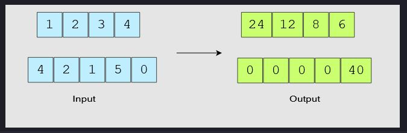
- Coding Exercise
    ```
    function findProduct(arr) {
        let newArr = [];
        let left = 1;
        for(i=0;i<arr.length;i++) {
            let current = 1;
            for(j=1+i;j<arr.length;j++) {
                current = current * arr[j];
            }
            newArr.push(current * left);
            left = left * arr[i];
            }
        return newArr;
    }
    ```
    - Time Complexity
        - only traverses over the array twice 
            - so the complexity expression is `n+n`
            - final term becomes `O(n)`


#### Solution Review: Array of Products of All Elements
- Optimized solution
    - calculate product of all elements and store it into `temp`
        - 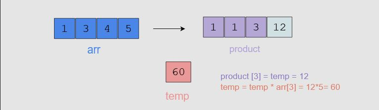
            ```
            for (var i = 0; i < arr.length ; i++) {
                product[i]  = temp;
                temp = temp * arr[i];
            }
            ```
    - traverse from the end and multiply product of all number 
        - 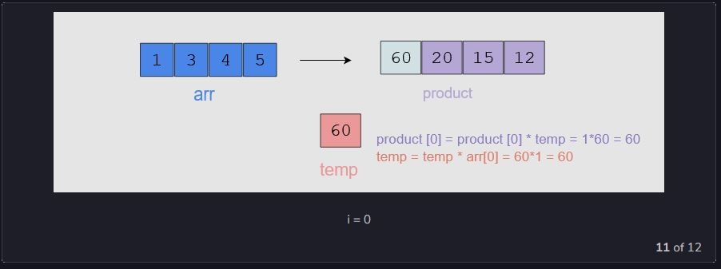
            ```
            temp = 1;
            for (var i = arr.length - 1; i > -1; i-- ) {
                product[i] *= temp;
                temp *= arr[i];
            }
            ```

#### Challenge 5: Find Minimum Value in Array
- Problem
    - Problem Statement
        - Implement a function `findMinimum(arr)`
            - Finds the smallest number in the given array.
    - Input
        - array of integers
    - Output
        - smallest number in the array
    - Sample Input

        ```
        arr = [9,2,3,6]
        ```

    - Sample Output 
        ```
        2
        ```
    - Picture
        - 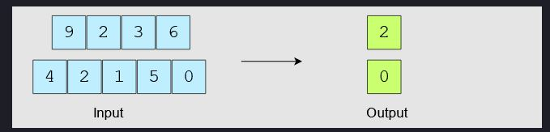
- Coding Exercise
    ```
    function findMinimum(arr) {
        let lowest=arr[0];

        for(i=1;i<arr.length;i++){
           if(arr[i]<lowest) {
             lowest=arr[i]
           }
        }
        return lowest;
    }
    ```

#### Solution Review: Find Minimum Value in Array
    ```
    function findMinimum(arr) {
        arr.sort((function(a, b){
            return a - b
        }))
        return arr[0]
    }
    ```
- Time Complexity
    - sort functions is O(nlogn)O(nlogn)O(
    - only return first value from an array so it will take constant time operation

#### Challenge 6: Find First Unique Integer in an Array
- Problem
    - Problem Statement
        - Implement a function `findMinimum(arr)`
            - 
    - Input
        - 
    - Output
        - 
    - Sample Input

        ```
        
        ```

    - Sample Output 

        ```
        2
        ```

    - Picture
        - 
- Coding Exercise
    ```
    
    ```

#### Solution Review: First First Unique Integer in an Array
#### Challenge 7: Find Second Maximum Value in an Array
- Problem
    - Problem Statement
        - Implement a function `findMinimum(arr)`
            - 
    - Input
        - 
    - Output
        - 
    - Sample Input

        ```
        
        ```

    - Sample Output 

        ```
        2
        ```

    - Picture
        - 
- Coding Exercise
    ```
    
    ```
#### Solution Review: Find Second Maximum Value in an Array
#### Challenge 8: Right Rotate an Array by n
- Problem
    - Problem Statement
        - Implement a function `findMinimum(arr)`
            - 
    - Input
        - 
    - Output
        - 
    - Sample Input

        ```
        
        ```

    - Sample Output 

        ```
        2
        ```

    - Picture
        - 
- Coding Exercise
    ```
    
    ```
#### Solution Review: Right Rotate an Array by n
#### Challenge 9: Rearrange Positive & Negative Values
- Problem
    - Problem Statement
        - Implement a function `findMinimum(arr)`
            - 
    - Input
        - 
    - Output
        - 
    - Sample Input

        ```
        
        ```

    - Sample Output 

        ```
        2
        ```

    - Picture
        - 
- Coding Exercise
    ```
    
    ```
#### Solution Review: Rearrange Positive & Negative Values
#### Challenge 10: Rearrange Sorted Array in Max/Min Form
- Problem
    - Problem Statement
        - Implement a function `findMinimum(arr)`
            - 
    - Input
        - 
    - Output
        - 
    - Sample Input

        ```
        
        ```

    - Sample Output 

        ```
        2
        ```

    - Picture
        - 
- Coding Exercise
    ```
    
    ```
#### Solution Review: Rearrange Sorted Array in Max/Min Form
#### Challenge 11: Maximum Sum Subarray
- Problem
    - Problem Statement
        - Implement a function `findMinimum(arr)`
            - 
    - Input
        - 
    - Output
        - 
    - Sample Input

        ```
        
        ```

    - Sample Output 

        ```
        2
        ```

    - Picture
        - 
- Coding Exercise
    ```
    
    ```
#### Solution Review: Maximum Sum Subarray
#### Arrays Quiz: Test Your Understanding of Arrays


### Introduction to Linked Lists
### Introduction to Stack/Queues
### Introduction to Graphs
### Introduction to Trees
### Trie
### Introduction to Heap
### Introduction to Hashing
### Summary of Data Structures
